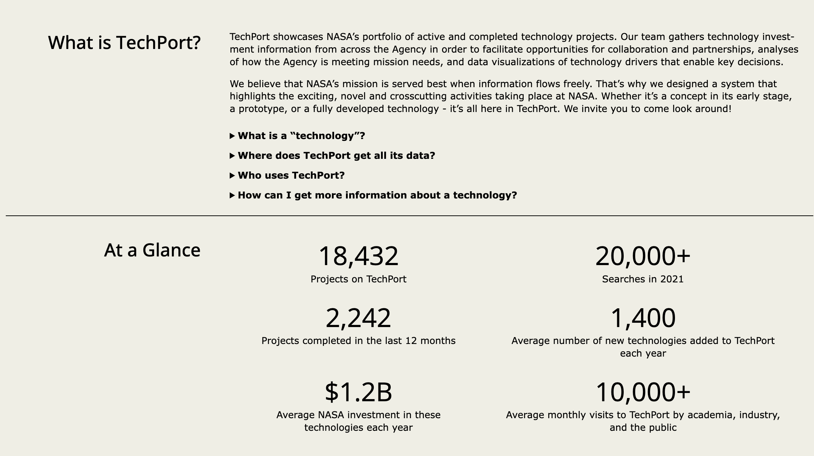

<div align="center">

[](https://techport.nasa.gov&#x2F;home)

# [Nasa](https://techport.nasa.gov&#x2F;home)<a id="nasa"></a>

TechPort RESTful API

</div>

## Table of Contents<a id="table-of-contents"></a>

<!-- toc -->

- [Installation](#installation)
- [Getting Started](#getting-started)
- [Reference](#reference)
  * [`nasatechport.organization.getInformation`](#nasatechportorganizationgetinformation)
  * [`nasatechport.organization.getListByName`](#nasatechportorganizationgetlistbyname)
  * [`nasatechport.organization.listTypes`](#nasatechportorganizationlisttypes)
  * [`nasatechport.project.findMatchingProjects`](#nasatechportprojectfindmatchingprojects)
  * [`nasatechport.project.getInfo`](#nasatechportprojectgetinfo)
  * [`nasatechport.project.listAvailableIds`](#nasatechportprojectlistavailableids)
  * [`nasatechport.resource.getSpecification`](#nasatechportresourcegetspecification)

<!-- tocstop -->

## Installation<a id="installation"></a>
<div align="center">
  <a href="https://konfigthis.com/sdk-sign-up?company=NASA&serviceName=TechPort&language=TypeScript">
    
  </a>
</div>

## Getting Started<a id="getting-started"></a>

```typescript
import { NasaTechPort } from "nasa-tech-port-typescript-sdk";

const nasatechport = new NasaTechPort({
  // Defining the base path is optional and defaults to https://techport.nasa.gov
  // basePath: "https://techport.nasa.gov",
  accessToken: "ACCESS_TOKEN",
});

const getInformationResponse = await nasatechport.organization.getInformation({
  organizationId: 1,
});

console.log(getInformationResponse);
```

## Reference<a id="reference"></a>


### `nasatechport.organization.getInformation`<a id="nasatechportorganizationgetinformation"></a>

Get an organization and its information.

#### 🛠️ Usage<a id="🛠️-usage"></a>

```typescript
const getInformationResponse = await nasatechport.organization.getInformation({
  organizationId: 1,
});
```

#### ⚙️ Parameters<a id="⚙️-parameters"></a>

##### organizationId: `number`<a id="organizationid-number"></a>

Organization Id.

#### 🔄 Return<a id="🔄-return"></a>

[OrganizationGetInformationResponse](./models/organization-get-information-response.ts)

#### 🌐 Endpoint<a id="🌐-endpoint"></a>

`/api/organizations/{organizationId}` `GET`

[🔙 **Back to Table of Contents**](#table-of-contents)

---


### `nasatechport.organization.getListByName`<a id="nasatechportorganizationgetlistbyname"></a>

Returns a list of organizations that match a given name.

#### 🛠️ Usage<a id="🛠️-usage"></a>

```typescript
const getListByNameResponse = await nasatechport.organization.getListByName({});
```

#### ⚙️ Parameters<a id="⚙️-parameters"></a>

##### name: `string`<a id="name-string"></a>

Organization Name to filter on.

#### 🔄 Return<a id="🔄-return"></a>

[OrganizationGetListByNameResponse](./models/organization-get-list-by-name-response.ts)

#### 🌐 Endpoint<a id="🌐-endpoint"></a>

`/api/organizations` `GET`

[🔙 **Back to Table of Contents**](#table-of-contents)

---


### `nasatechport.organization.listTypes`<a id="nasatechportorganizationlisttypes"></a>

Returns a list of available organization types, including set-aside and MSI types.

#### 🛠️ Usage<a id="🛠️-usage"></a>

```typescript
const listTypesResponse = await nasatechport.organization.listTypes();
```

#### 🔄 Return<a id="🔄-return"></a>

[OrganizationListTypesResponse](./models/organization-list-types-response.ts)

#### 🌐 Endpoint<a id="🌐-endpoint"></a>

`/api/organizations/types` `GET`

[🔙 **Back to Table of Contents**](#table-of-contents)

---


### `nasatechport.project.findMatchingProjects`<a id="nasatechportprojectfindmatchingprojects"></a>

Returns a list of projects matching the search term.

#### 🛠️ Usage<a id="🛠️-usage"></a>

```typescript
const findMatchingProjectsResponse =
  await nasatechport.project.findMatchingProjects({});
```

#### ⚙️ Parameters<a id="⚙️-parameters"></a>

##### projectId: `number`<a id="projectid-number"></a>

The specific ID of the project requested.

##### searchQuery: `string`<a id="searchquery-string"></a>

The term on which to search. Will check all project fields for the this term.

##### missionDirectorate: `string`<a id="missiondirectorate-string"></a>

The mission directorate acronym of the projects. Used to filter.

##### program: `string`<a id="program-string"></a>

The program acronym of the projects. Used to filter.

##### titleSearch: `string`<a id="titlesearch-string"></a>

The term on which to search. Will check only project titles for the this term.

#### 🔄 Return<a id="🔄-return"></a>

[ProjectFindMatchingProjectsResponseInner](./models/project-find-matching-projects-response-inner.ts)

#### 🌐 Endpoint<a id="🌐-endpoint"></a>

`/api/projects/search` `GET`

[🔙 **Back to Table of Contents**](#table-of-contents)

---


### `nasatechport.project.getInfo`<a id="nasatechportprojectgetinfo"></a>

Returns information about a specific technology project.

#### 🛠️ Usage<a id="🛠️-usage"></a>

```typescript
const getInfoResponse = await nasatechport.project.getInfo({
  projectId: 1,
});
```

#### ⚙️ Parameters<a id="⚙️-parameters"></a>

##### projectId: `number`<a id="projectid-number"></a>

ID of project to fetch

#### 🔄 Return<a id="🔄-return"></a>

[Project](./models/project.ts)

#### 🌐 Endpoint<a id="🌐-endpoint"></a>

`/api/projects/{projectId}` `GET`

[🔙 **Back to Table of Contents**](#table-of-contents)

---


### `nasatechport.project.listAvailableIds`<a id="nasatechportprojectlistavailableids"></a>

Returns a list of available technology project IDs.

#### 🛠️ Usage<a id="🛠️-usage"></a>

```typescript
const listAvailableIdsResponse = await nasatechport.project.listAvailableIds({
  updatedSince: "1970-01-01",
});
```

#### ⚙️ Parameters<a id="⚙️-parameters"></a>

##### updatedSince: `string | Date`<a id="updatedsince-string--date"></a>

ISO 8601 full-date in the format YYYY-MM-DD. Filters the list of available ID values by their lastUpdated parameter.

#### 🔄 Return<a id="🔄-return"></a>

[ProjectListAvailableIdsResponse](./models/project-list-available-ids-response.ts)

#### 🌐 Endpoint<a id="🌐-endpoint"></a>

`/api/projects` `GET`

[🔙 **Back to Table of Contents**](#table-of-contents)

---


### `nasatechport.resource.getSpecification`<a id="nasatechportresourcegetspecification"></a>

Returns the swagger specification for the API.

#### 🛠️ Usage<a id="🛠️-usage"></a>

```typescript
const getSpecificationResponse = await nasatechport.resource.getSpecification();
```

#### 🌐 Endpoint<a id="🌐-endpoint"></a>

`/api` `GET`

[🔙 **Back to Table of Contents**](#table-of-contents)

---


## Author<a id="author"></a>
This TypeScript package is automatically generated by [Konfig](https://konfigthis.com)
